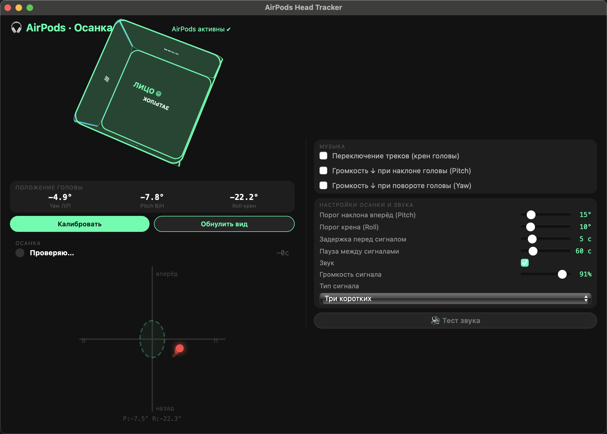

# AirPods Head Tracker 🎧

**Native macOS app**: real head tracking from AirPods Pro / Max — 3D visualization,
posture monitoring and hands-free music control.

**[⬇ Download DMG](https://github.com/antonenkoo/airpods-head-tracker/releases/latest)** ·
**[Website](https://antonenkoo.github.io/airpods-head-tracker/)**



## Features
- 🧊 Live 3D head tracking (yaw / pitch / roll) via `CMHeadphoneMotionManager`
- 🪑 Posture monitor — sound reminder when you slouch towards the screen
- 🎵 Switch tracks in Spotify / Apple Music with head gestures
- 🔊 Optional volume control by head motion

Requires **macOS 14+** and AirPods with Spatial Audio head tracking
(AirPods Pro 1/2, AirPods Max, AirPods 3+).

## Build from source

No Xcode needed — Command Line Tools are enough:

```bash
cd airpods-native
./build.sh          # compiles AirPodsTracker.app (swiftc + ad-hoc codesign)
open AirPodsTracker.app
./make-dmg.sh       # packages the DMG
```

On first launch allow **Motion & Fitness** access — that's the head-tracking
sensor permission. The web UI is also served at `http://localhost:8765`
(same interface as the app window), handy for opening on a phone in the same network.

See [airpods-native/README.md](airpods-native/README.md) for troubleshooting.

## Repo layout
```
airpods-native/     # the macOS app (Swift: CoreMotion + HTTP server + WKWebView shell)
docs/               # landing page (GitHub Pages)
public/, server.js  # legacy browser-gyroscope experiment (phone strapped to headphones)
```

## License
MIT
